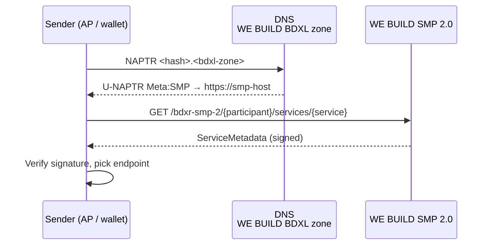
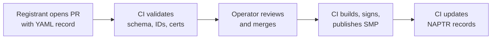

# WE BUILD SMP/BDXL Conformance Specification

Draft 0.2 · 2026-09-25 · Rune Kjørlaug

## 1. Scope and status

This specification defines how WE BUILD participants publish and look up delivery capabilities during the pilot. It uses OASIS SMP 2.0 for metadata and OASIS BDXL for discovery, with one project-run BDXL zone and one project-run SMP. It does not depend on the Peppol network, its SML, its PKI or its identifier policy.

**In scope:**

- DNS-based discovery of the SMP for a participant (BDXL U-NAPTR)
- Read-only SMP 2.0 interface: ServiceGroup and ServiceMetadata
- Identifier schemes, normalisation and URL encoding
- Metadata signing and trust anchors
- Transport profiles, for AS4 and wallet endpoints
- The registration procedure for adding or changing entries

**Out of scope:**

- Write and management interfaces for BDXL and SMP. Registration goes through the procedure in section 9.
- Multiple SMPs and `Redirect`. The spec keeps the BDXL step so a second SMP can be added later without client changes.
- Production use. The service is for pilot and test traffic only.

The spec defines the interface only, not how it is implemented. The static setup in section 11 is one conforming implementation. Any SMP 2.0 server that meets sections 4–8 can replace it.

## 2. References and conformance language

The key words MUST, MUST NOT, SHOULD, SHOULD NOT and MAY are to be read as described in RFC 2119 and RFC 8174.

| Ref | Document | Used for |
| --- | --- | --- |
| [SMP2] | [OASIS Service Metadata Publishing (SMP) Version 2.0](https://docs.oasis-open.org/bdxr/bdx-smp/v2.0/os/bdx-smp-v2.0-os.html), OASIS Standard | Resource model, REST binding, XML schemas, signature |
| [BDXL] | [OASIS Business Document Metadata Service Location Version 1.0](https://docs.oasis-open.org/bdxr/BDX-Location/v1.0/BDX-Location-v1.0.html) | U-NAPTR discovery |
| [ebCore] | OASIS ebCore Party Id Type Technical Specification 1.0 | Participant identifier schemes |
| [RFC3403] | Dynamic Delegation Discovery System (DDDS) Part Three: The DNS Database | NAPTR record format |
| [RFC4648] | The Base16, Base32 and Base64 Data Encodings | Base32 hash encoding |
| [RFC3986] | Uniform Resource Identifier (URI): Generic Syntax | Percent-encoding |
| [XMLDSIG] | XML Signature Syntax and Processing 1.1 | Signed metadata |

[SMP2] allows unsigned metadata and optional BDXL, and [BDXL] leaves the construction of hostnames to each network. This spec is a WE BUILD profile that makes those choices; see sections 5 and 7.

## 3. Architecture overview

A sender finds a receiver's endpoint in two steps: a BDXL NAPTR query gives the SMP base URL, then an HTTP GET gives the signed ServiceMetadata. The registry repository is the single source for both.



| Role | Responsibility | Operated by |
| --- | --- | --- |
| Registry repository | Holds the registration records and runs validation, signing and publication | WE BUILD SMP operator |
| BDXL zone | DNS zone that maps participant identifiers to the SMP URL | WE BUILD SMP operator |
| SMP | Serves ServiceGroup and ServiceMetadata per [SMP2] | WE BUILD SMP operator |
| Registrant | A WE BUILD partner that registers participants and endpoints | Pilot partners |
| Sender | Access point or wallet that looks up a receiver | Pilot partners |

## 4. Identifiers

Participants are identified with ebCore party ID schemes. Services (document types) and processes use [SMP2] `schemeID`/value pairs. Everything is written as `{scheme}::{value}`, or just `{value}` when there is no scheme. A static host cannot fix differences in case or encoding, so this section is stricter than [SMP2].

| Identifier | Scheme | Example value |
| --- | --- | --- |
| Participant | `urn:oasis:names:tc:ebcore:partyid-type:iso6523:{ICD}` | `991825827` (ICD 0192) |
| Service | `bdx-docid-qns` | `urn:oasis:names:specification:ubl:schema:xsd:Invoice-2::Invoice##urn:cen.eu:en16931:2017::2.1` |
| Process | none, or a WE BUILD scheme | `urn:webuild:sc5:einvoicing:1.0` (placeholder) |

**Requirements:**

- **ID-01** Registrants MUST register participant scheme and value in lower case.
- **ID-02** Senders MUST lower-case the full participant identifier `{scheme}::{value}` before hashing (section 5) and before building the SMP URL (section 6).
- **ID-03** Participant schemes MUST come from the list the operator publishes. The initial list is ISO 6523 ICDs 0192, 0088 and 0208, as ebCore URNs.
- **ID-04** Service and process identifiers are case-sensitive. They MUST be used exactly as registered.
- **ID-05** In URLs, each identifier MUST be percent-encoded as one path segment, as [SMP2] requires. At least `:` becomes `%3A`, `#` becomes `%23` and `/` becomes `%2F`.
- **ID-06** The SMP MUST also accept `:` unencoded, because clients differ in practice.

## 5. Discovery: BDXL

Discovery uses [BDXL] U-NAPTR records in one WE BUILD zone. [BDXL] leaves the construction of hostnames to each network. WE BUILD hashes the whole lower-cased identifier into a single label, because ebCore schemes are URNs and cannot be DNS labels:

```
host = lower( strip_padding( base32( sha256( lower("{scheme}::{value}") ) ) ) ) + "." + BDXL zone
```

Example for `urn:oasis:names:tc:ebcore:partyid-type:iso6523:0192::991825827`, with a placeholder zone:

```
ip63r3rgist7ifth33655ysdi4jbdla4mdrjccksluobtxewxnba.bdxl.webuild.example. 3600 IN NAPTR 100 10 "U" "Meta:SMP" "!^.*$!https://smp.webuild.example!" .
```

**Requirements:**

- **BDXL-01** The operator MUST publish the BDXL zone name. Senders MUST let it be configured.
- **BDXL-02** Senders MUST build the hostname as shown above. The hash input is the UTF-8 bytes of the lower-cased `{scheme}::{value}`. Base32 is per [RFC4648], with `=` padding removed; the label is written in lower case.
- **BDXL-03** The zone MUST answer with a NAPTR record with flag `U`, service `Meta:SMP` and a regexp `!^.*$!{SMP base URL}!`.
- **BDXL-04** Senders MUST take the SMP base URL from the NAPTR regexp result and append the [SMP2] resource path to it. They MUST NOT use the NAPTR owner name as the HTTP host.
- **BDXL-05** The operator MUST run the zone in one of two modes, and publish which:
  - *Explicit mode (default):* one record per registered participant. An unregistered participant gets NXDOMAIN.
  - *Wildcard mode:* one `*.{zone}` record. Any participant resolves, and an unregistered one gets HTTP 404 from the SMP.
- **BDXL-06** Records SHOULD have a TTL of 3600 s or less.

The hash is a single label of 52 characters, well under the DNS limit of 63.

## 6. SMP interface

The SMP implements the [SMP2] REST binding (`oasis-bdxr-smp-2`), read-only, under the `/bdxr-smp-2/` path of the SMP base URL.

| Resource | Path | Root element (namespace) |
| --- | --- | --- |
| ServiceGroup | `/bdxr-smp-2/{participant}` | `ServiceGroup` (`http://docs.oasis-open.org/bdxr/ns/SMP/2/ServiceGroup`) |
| ServiceMetadata | `/bdxr-smp-2/{participant}/services/{service}` | `ServiceMetadata` (`http://docs.oasis-open.org/bdxr/ns/SMP/2/ServiceMetadata`) |

**Requirements:**

- **SMP-01** The SMP MUST be reachable over HTTPS on port 443 with a publicly trusted TLS certificate.
- **SMP-02** A registered resource MUST return HTTP 200 with a UTF-8 document that has an XML declaration and validates against the [SMP2] XSDs. `SMPVersionID` MUST be `2.0`.
- **SMP-03** An unknown participant or service MUST return HTTP 404.
- **SMP-04** Senders MUST follow HTTP 301, 302, 307 and 308 redirects within the same host.
- **SMP-05** Responses MUST carry `Content-Type: application/xml`, as [SMP2] requires.
- **SMP-06** Senders MUST request ServiceMetadata directly. They MUST NOT depend on fetching the ServiceGroup first.
- **SMP-07** Every `ProcessMetadata` MUST contain `Endpoint` elements and MUST NOT contain `Redirect`.
- **SMP-08** Every `Endpoint` MUST contain `AddressURI`, `ExpirationDate` and at least one `Certificate`.

**Static hosting.** A static host stores the ServiceGroup as `index.html` inside the participant's folder, so it is reached through a redirect. SMP-04 allows that. SMP-05 rules out hosts that cannot set response headers, such as GitHub Pages. Hosts that can, such as Cloudflare Pages or Netlify, conform.

## 7. Metadata signing and trust anchors

Signing is optional in [SMP2]; in WE BUILD it is mandatory. Both ServiceGroup and ServiceMetadata are signed with the WE BUILD SMP key, which chains to a WE BUILD test CA.

- **SIG-01** Every ServiceGroup and ServiceMetadata MUST carry exactly one enveloped `ds:Signature` as its last child element, as [SMP2] requires. It uses `Reference URI=""` and the transform `http://www.w3.org/2000/09/xmldsig#enveloped-signature`.
- **SIG-02** Algorithms: canonicalisation `http://www.w3.org/2006/12/xml-c14n11`, signature `http://www.w3.org/2001/04/xmldsig-more#rsa-sha256`, digest `http://www.w3.org/2001/04/xmlenc#sha256`.
- **SIG-03** `KeyInfo/X509Data/X509Certificate` MUST contain the signing certificate.
- **SIG-04** The signing certificate MUST chain to the WE BUILD SMP trust anchor, which the operator publishes at `{SMP base URL}/trust/trust-anchor.pem` and alongside this spec. Senders MUST let this anchor be configured.
- **SIG-05** Senders MUST verify the signature and the chain before using any endpoint. A failed check MUST be treated as "no endpoint found".
- **SIG-06** The signing key MUST NOT be stored in the registry repository. It MAY be held as a CI secret for the pilot. It MUST be rotated if any person with admin rights on the repository leaves the pilot.
- **SIG-07** Endpoint certificates are carried as `Certificate/ContentBinaryObject` (base64 DER, `mimeCode="application/base64"`). They MUST chain to the anchor that the endpoint's transport profile names (section 8).
- **SIG-08** The SMP signing certificate MUST carry KeyUsage `digitalSignature`. The trust anchor MUST carry `keyCertSign` and BasicConstraints `CA:true`. Common verifiers reject chains without these.

Metadata is signed before publication, so a compromised host can withhold or roll back metadata but cannot forge it. Rollback is limited by `ExpirationDate` (REG-05).

## 8. Transport profiles

An endpoint's `TransportProfileID` says how to reach it. AS4 and wallet endpoints sit in the same ServiceMetadata, so a sender can find either through one lookup.

| TransportProfileID | Use | AddressURI | Certificate anchor |
| --- | --- | --- | --- |
| `bdxr-transport-ebms3-as4-v1p0` | OASIS AS4 profile of ebMS 3.0 | AS4 MSH URL | WE BUILD AS4 test CA (to be defined) |
| `webuild-transport-wmp-v1` (proposed) | Wallet Messaging Protocol inbox | WMP endpoint URL | WE BUILD wallet anchor (to be defined) |

- **TP-01** Registrants MUST use only profile IDs listed in this table. New profiles are added by changing this spec.
- **TP-02** One `ProcessMetadata` MAY list several endpoints with different profiles. The sender picks one it supports.
- **TP-03** Senders MUST ignore endpoints whose profile they do not support. They MUST NOT fail the lookup because of them.

## 9. Registration and change procedure

A pull request to the registry repository is how a registration is requested, and merging it is the approval. The git history is the audit log.



- **REG-01** Registrants MUST submit one YAML record per participant, in the format of the reference implementation. They MUST NOT submit generated XML.
- **REG-02** A PR MUST pass automated validation before review. This covers the record schema, lower-case participant ID, known transport profile, parseable endpoint certificate, and a valid date range.
- **REG-03** Merging to `main` MUST need approval from at least one operator who is not the PR author.
- **REG-04** A participant is removed by deleting its record. The next publication removes both the SMP resources and the NAPTR record.
- **REG-05** Each endpoint MUST have an `ExpirationDate` no later than the planned pilot end date. CI MUST reject records with expired dates.
- **REG-06** Changes SHOULD be live, both DNS and SMP, within 60 minutes of merging.

## 10. Conformance requirements by role

A sender or operator conforms if it meets every MUST in its column.

| ID | Requirement (short) | Operator | Registrant | Sender |
| --- | --- | --- | --- | --- |
| ID-01 | Participant scheme and value in lower case | check | MUST | |
| ID-02 | Lower-case participant ID before hashing and URL building | | | MUST |
| ID-03 | Participant scheme from the published list | check | MUST | |
| ID-04 | Service and process IDs used exactly as registered | | MUST | MUST |
| ID-05 | Each identifier percent-encoded as one segment | MUST | | MUST |
| ID-06 | Accept unencoded `:` | MUST | | |
| BDXL-01 | Published, configurable BDXL zone | MUST | | MUST |
| BDXL-02 | Host = lower(base32(sha256(lower(scheme::value)))).zone | MUST | | MUST |
| BDXL-03 | U-NAPTR, `Meta:SMP`, regexp yields SMP base URL | MUST | | |
| BDXL-04 | Use the NAPTR result URL, not the owner name | | | MUST |
| BDXL-05 | Explicit or wildcard mode, published | MUST | | |
| BDXL-06 | TTL ≤ 3600 s | SHOULD | | |
| SMP-01 | HTTPS 443, public TLS cert | MUST | | |
| SMP-02 | 200, XSD-valid, `SMPVersionID` 2.0 | MUST | | |
| SMP-03 | 404 for unknown resources | MUST | | |
| SMP-04 | Follow same-host redirects | | | MUST |
| SMP-05 | `Content-Type: application/xml` | MUST | | |
| SMP-06 | Direct ServiceMetadata lookup | | | MUST |
| SMP-07 | Endpoints only, no `Redirect` | MUST | | |
| SMP-08 | AddressURI, ExpirationDate, Certificate per endpoint | check | MUST | |
| SIG-01–03 | Enveloped RSA-SHA256, C14N 1.1, cert in X509Data | MUST | | |
| SIG-04–05 | Configurable trust anchor, verify before use | MUST | | MUST |
| SIG-06 | Key outside repo, rotation on admin change | MUST | | |
| SIG-07 | Endpoint certs chain to profile anchor | check | MUST | SHOULD verify |
| SIG-08 | KeyUsage on signing cert and anchor | MUST | | |
| TP-01–03 | Listed profiles only, ignore unsupported | check | MUST | MUST |
| REG-01–06 | PR-based registration, review, expiry | MUST | MUST | |

"check" means the operator's CI enforces the requirement on the registrant's behalf.

## 11. Reference implementation and testing

The reference implementation is this repository; its YAML records are the registry. GitHub Actions turns the records into a static SMP 2.0 site on Cloudflare Pages and a set of BDXL records in a DNS zone with an API (deSEC in the pilot deployment; Cloudflare DNS is also supported). There is no server-side code. GitHub Pages is supported as an alternative host, but it fails SMP-05 because it cannot set `Content-Type`.

| Pipeline job | Runs on | Does | Spec |
| --- | --- | --- | --- |
| validate | every PR | Schema, lower-case IDs, allowed schemes and profiles, cert parse, dates, file-name length; trial build with a throwaway key; OASIS XSD validation | REG-02, ID-01, ID-03, TP-01, REG-05, SMP-02 |
| build | merge to `main`, weekly | Generates and signs ServiceGroup and ServiceMetadata, validates against the XSDs, verifies its own signatures | SMP-02, SIG-01–03 |
| deploy | after build | Publishes the site, with a `_headers` file that sets `application/xml` | SMP-01, SMP-05 |
| dns | after deploy | Syncs U-NAPTR records to the BDXL zone, then waits until its authoritative servers serve them | BDXL-03, BDXL-05, REG-04 |
| smoke | after dns | Probes the live service as a sender, including negative tests | Sections 5–7 |

Tested on 2026-09-25 against the Cloudflare Pages local emulator (`wrangler pages dev`): all 10 probe checks pass.

- ServiceMetadata was served under both encodings with `application/xml`.
- Both signatures and the chain to the test CA verified.
- The ServiceGroup was served through a 308 redirect.
- An unknown participant returned 404.
- The emulator serves files stored under decoded names; files stored under encoded names get 404.

Tested on 2026-10-09 against the live pilot deployment (`smp.webuild.kjorlaug.no` on Cloudflare Pages, BDXL zone `bdxl.webuild.kjorlaug.no` on deSEC, DNSSEC-signed and delegated with DS from `kjorlaug.no`): all 12 probe checks pass, including the BDXL lookup, with only the decoded layout deployed. Real Cloudflare Pages behaves like the emulator.
- Invalid records were rejected by validation.

For comparison, a plain static server failed SMP-05 on both resources. XSD validation runs in CI only, because the OASIS schema host could not be reached from the test environment.

**Conformance testing for senders.** A partner's sender passes if, when configured with the WE BUILD BDXL zone and trust anchor, it:

1. Resolves the test participant through BDXL.
2. Retrieves and verifies the ServiceMetadata.
3. Selects the endpoint for its transport profile.
4. Treats an unregistered participant as "not found".

The operator publishes the test participant and the expected results.

## 12. Open issues

- [x] **Live host check.** Confirm on real Cloudflare Pages what the emulator showed: decoded file names, `_headers` applied, 308 for the ServiceGroup. Then set `path_layouts: [decoded]`. *Done 2026-10-09 on smp.webuild.kjorlaug.no: decoded-only layout serves both encodings, `_headers` applied, ServiceGroup 200 via 308; smoke_test.py 10/10 (`--no-dns`).*
- [ ] **Real client test.** Run at least one SMP 2.0 client, for example the BDXR2 client in phoss smp-client, with BDXL discovery. Include the redirect for the ServiceGroup.
- [ ] **BDXL hash rule.** Confirm the WE BUILD rule of one label over the full identifier (BDXL-02) against what partner clients can configure. Some BDXL clients only offer the Peppol/eDelivery rule with a scheme label.
- [x] **Zone and host names.** Fix `bdxl_zone` and `smp_base_url`, and the Cloudflare account that runs Pages and DNS. *Pilot: `smp.webuild.kjorlaug.no` (Cloudflare Pages) and `bdxl.webuild.kjorlaug.no` (deSEC, because the parent's DNS host, Domeneshop, has no NAPTR).*
- [ ] **Participant schemes.** Confirm the ICD list for ID-03 against the pilot's participants.
- [ ] **WE BUILD process and service identifiers.** Agree a URN namespace for SC5 processes and for WE BUILD-specific services, such as attestations.
- [ ] **Transport profiles and anchors.** Define the AS4 test CA, the wallet anchor, and the WMP profile ID with the WMP authors.
- [ ] **Identifier length.** Encoded identifiers must fit in 255 bytes as file names. Check this against the longest identifiers the pilot will use.
- [ ] **Pilot end date.** Set `pilot_end_date` as the upper bound for ExpirationDate (REG-05).
- [ ] **Key custody.** Decide who holds the offline CA key and who has repository admin rights (SIG-06).
